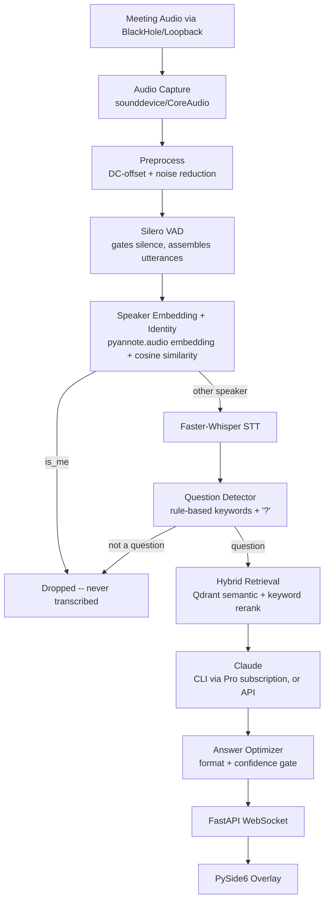

# Architecture

## Pipeline

Two OS processes, one local WebSocket between them:

- **Backend** (`meeting_copilot.server`): FastAPI + asyncio/uvloop. Owns the
  `MeetingPipeline` (`pipeline/orchestrator.py`), which chains every stage
  above. Each detected speech segment is handled in its own `asyncio.Task` so
  a slow Claude call never blocks VAD from keeping up with live audio.
- **Overlay** (`meeting_copilot.desktop`): a thin PySide6 window. It does no
  ML work -- it only renders `Answer` payloads pushed over `/ws` and reacts to
  global hotkeys (`pynput`, since Qt shortcuts don't fire while unfocused).

## Key decisions

**Audio capture -- `sounddevice` + BlackHole.** pyannote/Whisper need a single
mono stream containing both the user's mic and the meeting app's output.
BlackHole (or Loopback) plus a macOS Multi-Output Device gives us that at the
OS level; `sounddevice` (PortAudio) reads it. This routing is a one-time
manual system change -- see [installation.md](installation.md).

**Speaker ID -- per-segment embedding, not full diarization.**
pyannote.audio's diarization `Pipeline` is built for offline, whole-file
processing, not a live stream. Instead, each Silero-VAD-bounded utterance
(`speaker.window_seconds`, default ~5s) is embedded as a whole
(`pyannote/embedding`) and compared by cosine similarity: above
`speaker.ignore_similarity_threshold` against the enrolled "me" vector means
ignore; otherwise nearest-centroid online clustering assigns Speaker A/B/C.
This is a pragmatic approximation, not true multi-speaker diarization with
overlap detection -- see `speaker/diarization.py` and `speaker/identity.py`.

**STT -- Faster-Whisper on VAD-gated chunks, not token streaming.**
Faster-Whisper doesn't stream token-by-token either; each VAD-assembled
utterance is transcribed as one blocking call (run in a thread so it doesn't
stall the event loop). `stt.model_size` trades latency for accuracy per
machine.

**Question detection -- rule-based v1.** An utterance triggers the LLM if it
ends in "?" or matches a topic keyword, unless it's a denylisted
greeting/small-talk phrase without also containing a keyword. Lives behind
`nlp.question_detector.QuestionDetector` so a model-based classifier can
replace it later without touching the orchestrator.

**Retrieval -- hybrid, offline-only.** `retrieval/hybrid_search.py` fuses
Qdrant's semantic score with a simple keyword-overlap score
(`retrieval.hybrid_alpha`), since Qdrant alone has no BM25-style lexical
scoring. Nothing at meeting time ever calls out to the internet -- the
knowledge base is built entirely ahead of time by
`knowledge/ingestion.py` (`make ingest`).

**LLM -- Claude Pro via CLI by default, API optional.** `llm.backend: cli`
(default) shells out to the Claude Code CLI, authenticated with your existing
Claude Pro/Max subscription (`claude login`) -- no separate Anthropic API
billing. `llm.backend: api` uses the Anthropic Messages API directly with
`ANTHROPIC_API_KEY` and is meaningfully faster. See
[performance.md](performance.md) for the concrete latency tradeoff; both
backends sit behind `llm/claude_client.py::ClaudeClient` so the rest of the
pipeline doesn't care which is active.

**Caching -- Redis.** Embedding cache (avoid re-embedding repeated phrases),
LLM response cache (keyed on question + retrieved-context hash, so a
repeated question in the same meeting doesn't re-call Claude), and STT dedup
(skip re-processing an identical utterance seen moments ago).

**Knowledge store -- SQLite alongside Qdrant.** Qdrant holds the actual chunk
vectors + payload; `knowledge/store.py` is a small SQLite ingestion-job log
(topic, source/chunk counts, status) so `make ingest` runs are debuggable.
`speaker/identity.py::EnrollmentStore` similarly uses SQLite for the single
enrolled "me" embedding.

**Monitoring -- Prometheus + Grafana.** `pipeline/metrics.py` records a
per-stage latency histogram (`meeting_copilot_stage_latency_seconds{stage=...}`)
and a total end-to-end histogram, exposed at `/metrics` on the FastAPI app.
`docker-compose.yml`'s `monitoring` profile brings up Prometheus + a
provisioned Grafana instance.

**Packaging -- PyInstaller, not Docker, for the app itself.** PySide6 needs
the native macOS display, so only Qdrant/Redis run in Docker; the backend +
overlay are bundled into one `.app` via `meeting-copilot.spec`.
